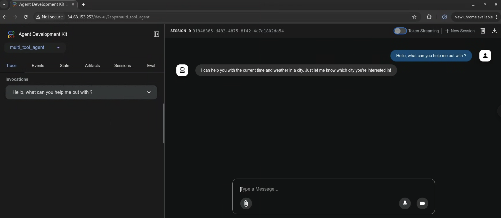

# Deploy to Google Kubernetes Engine (GKE)

[GKE](https://cloud.google.com/gke) is the Google Cloud managed Kubernetes service. It allows you to deploy and manage containerized applications using Kubernetes.

To deploy your agent you will need to have a Kubernetes cluster running on GKE. You can create a cluster using the Google Cloud Console or the `gcloud` command line tool.

In this example we will deploy a simple agent to GKE. The agent will be a FastAPI application that uses `Gemini 2.0 Flash` as the LLM. We can use Vertex AI or AI Studio as the LLM provider using the Environment variable `GOOGLE_GENAI_USE_VERTEXAI`.

## Environment variables

Set your environment variables as described in the [Setup and Installation](../get-started/installation.md) guide. You also need to install the `kubectl` command line tool. You can find instructions to do so in the [Google Kubernetes Engine Documentation](https://cloud.google.com/kubernetes-engine/docs/how-to/cluster-access-for-kubectl).

```bash
export GOOGLE_CLOUD_PROJECT=your-project-id # Your GCP project ID
export GOOGLE_CLOUD_LOCATION=us-central1 # Or your preferred location
export GOOGLE_GENAI_USE_VERTEXAI=true # Set to true if using Vertex AI
export GOOGLE_CLOUD_PROJECT_NUMBER=$(gcloud projects describe --format json $GOOGLE_CLOUD_PROJECT | jq -r ".projectNumber")
```

If you don't have `jq` installed, you can use the following command to get the project number:

```bash
gcloud projects describe $GOOGLE_CLOUD_PROJECT
```

And copy the project number from the output.

```bash
export GOOGLE_CLOUD_PROJECT_NUMBER=YOUR_PROJECT_NUMBER
```


## Enable APIs and Permissions

Ensure you have authenticated with Google Cloud (`gcloud auth login` and `gcloud config set project <your-project-id>`).

Enable the necessary APIs for your project. You can do this using the `gcloud` command line tool.

```bash
gcloud services enable \
    container.googleapis.com \
    artifactregistry.googleapis.com \
    cloudbuild.googleapis.com \
    aiplatform.googleapis.com
```

Grant necessary roles to the default compute engine service account required by the `gcloud builds submit` command.


```bash
ROLES_TO_ASSIGN=(
    "roles/artifactregistry.writer"
    "roles/storage.objectViewer"
    "roles/logging.viewer"
    "roles/logging.logWriter"
)

for ROLE in "${ROLES_TO_ASSIGN[@]}"; do
    gcloud projects add-iam-policy-binding "${GOOGLE_CLOUD_PROJECT}" \
        --member="serviceAccount:${GOOGLE_CLOUD_PROJECT_NUMBER}-compute@developer.gserviceaccount.com" \
        --role="${ROLE}"
done
```

## Deployment payload {#payload}

When you deploy your ADK agent workflow to the Google Cloud GKE,
the following content is uploaded to the service:

- Your ADK agent code
- Any dependencies declared in your ADK agent code
- ADK API server code version used by your agent

The default deployment *does not* include the ADK web user interface libraries,
unless you specify it as deployment setting, such as the `--with_ui` option for
`adk deploy gke` command.

## Deployment options

You can deploy your agent to GKE either **manually using Kubernetes manifests** or **automatically using the `adk deploy gke` command**. Choose the approach that best suits your workflow.


## Option 1: Manual Deployment using gcloud and kubectl

### Create a GKE cluster

You can create a GKE cluster using the `gcloud` command line tool. This example creates an Autopilot cluster named `adk-cluster` in the `us-central1` region.

> If creating a GKE Standard cluster, make sure [Workload Identity](https://cloud.google.com/kubernetes-engine/docs/how-to/workload-identity) is enabled. Workload Identity is enabled by default in an AutoPilot cluster.

```bash
gcloud container clusters create-auto adk-cluster \
    --location=$GOOGLE_CLOUD_LOCATION \
    --project=$GOOGLE_CLOUD_PROJECT
```

After creating the cluster, you need to connect to it using `kubectl`. This command configures `kubectl` to use the credentials for your new cluster.

```bash
gcloud container clusters get-credentials adk-cluster \
    --location=$GOOGLE_CLOUD_LOCATION \
    --project=$GOOGLE_CLOUD_PROJECT
```

### Create Your Agent

We will reference the `capital_agent` example defined on the [LLM agents](../agents/llm-agents.md) page.

To proceed, organize your project files as follows:

```txt
your-project-directory/
├── capital_agent/
│   ├── __init__.py
│   └── agent.py       # Your agent code (see "Capital Agent example" below)
├── main.py            # FastAPI application entry point
├── requirements.txt   # Python dependencies
└── Dockerfile         # Container build instructions
```


### Code files

Create the following files (`main.py`, `requirements.txt`, `Dockerfile`, `capital_agent/agent.py`, `capital_agent/__init__.py`) in the root of `your-project-directory/`.

1. This is the Capital Agent example inside the `capital_agent` directory

    ```python title="capital_agent/agent.py"
    from google.adk.agents import LlmAgent 

    # Define a tool function
    def get_capital_city(country: str) -> str:
      """Retrieves the capital city for a given country."""
      # Replace with actual logic (e.g., API call, database lookup)
      capitals = {"france": "Paris", "japan": "Tokyo", "canada": "Ottawa"}
      return capitals.get(country.lower(), f"Sorry, I don't know the capital of {country}.")

    # Add the tool to the agent
    capital_agent = LlmAgent(
        model="gemini-2.0-flash",
        name="capital_agent", #name of your agent
        description="Answers user questions about the capital city of a given country.",
        instruction="""You are an agent that provides the capital city of a country... (previous instruction text)""",
        tools=[get_capital_city] # Provide the function directly
    )

    # ADK will discover the root_agent instance
    root_agent = capital_agent
    ```
    
    Mark your directory as a python package

    ```python title="capital_agent/__init__.py"

    from . import agent
    ```

2. This file sets up the FastAPI application using `get_fast_api_app()` from ADK:

    ```python title="main.py"
    import os

    import uvicorn
    from fastapi import FastAPI
    from google.adk.cli.fast_api import get_fast_api_app

    # Get the directory where main.py is located
    AGENT_DIR = os.path.dirname(os.path.abspath(__file__))
    # Example session service URI (e.g., SQLite)
    SESSION_SERVICE_URI = "sqlite:///./sessions.db"
    # Example allowed origins for CORS
    ALLOWED_ORIGINS = ["http://localhost", "http://localhost:8080", "*"]
    # Set web=True if you intend to serve a web interface, False otherwise
    SERVE_WEB_INTERFACE = True

    # Call the function to get the FastAPI app instance
    # Ensure the agent directory name ('capital_agent') matches your agent folder
    app: FastAPI = get_fast_api_app(
        agents_dir=AGENT_DIR,
        session_service_uri=SESSION_SERVICE_URI,
        allow_origins=ALLOWED_ORIGINS,
        web=SERVE_WEB_INTERFACE,
    )

    # You can add more FastAPI routes or configurations below if needed
    # Example:
    # @app.get("/hello")
    # async def read_root():
    #     return {"Hello": "World"}

    if __name__ == "__main__":
        # Use the PORT environment variable provided by Cloud Run, defaulting to 8080
        uvicorn.run(app, host="0.0.0.0", port=int(os.environ.get("PORT", 8080)))
    ```

    *Note: We specify `agent_dir` to the directory `main.py` is in and use `os.environ.get("PORT", 8080)` for Cloud Run compatibility.*

3. List the necessary Python packages:

    ```txt title="requirements.txt"
    google-adk
    # Add any other dependencies your agent needs
    ```

4. Define the container image:

    ```dockerfile title="Dockerfile"
    FROM python:3.13-slim
    WORKDIR /app

    COPY requirements.txt .
    RUN pip install --no-cache-dir -r requirements.txt

    RUN adduser --disabled-password --gecos "" myuser && \
        chown -R myuser:myuser /app

    COPY . .

    USER myuser

    ENV PATH="/home/myuser/.local/bin:$PATH"

    CMD ["sh", "-c", "uvicorn main:app --host 0.0.0.0 --port $PORT"]
    ```

### Build the container image

You need to create a Google Artifact Registry repository to store your container images. You can do this using the `gcloud` command line tool.

```bash
gcloud artifacts repositories create adk-repo \
    --repository-format=docker \
    --location=$GOOGLE_CLOUD_LOCATION \
    --description="ADK repository"
```

Build the container image using the `gcloud` command line tool. This example builds the image and tags it as `adk-repo/adk-agent:latest`.

```bash
gcloud builds submit \
    --tag $GOOGLE_CLOUD_LOCATION-docker.pkg.dev/$GOOGLE_CLOUD_PROJECT/adk-repo/adk-agent:latest \
    --project=$GOOGLE_CLOUD_PROJECT \
    .
```

Verify the image is built and pushed to the Artifact Registry:

```bash
gcloud artifacts docker images list \
  $GOOGLE_CLOUD_LOCATION-docker.pkg.dev/$GOOGLE_CLOUD_PROJECT/adk-repo \
  --project=$GOOGLE_CLOUD_PROJECT
```

### Configure Kubernetes Service Account for Vertex AI

If your agent uses Vertex AI, you need to create a Kubernetes service account with the necessary permissions. This example creates a service account named `adk-agent-sa` and binds it to the `Vertex AI User` role.

> If you are using AI Studio and accessing the model with an API key you can skip this step.

```bash
kubectl create serviceaccount adk-agent-sa
```

```bash
gcloud projects add-iam-policy-binding projects/${GOOGLE_CLOUD_PROJECT} \
    --role=roles/aiplatform.user \
    --member=principal://iam.googleapis.com/projects/${GOOGLE_CLOUD_PROJECT_NUMBER}/locations/global/workloadIdentityPools/${GOOGLE_CLOUD_PROJECT}.svc.id.goog/subject/ns/default/sa/adk-agent-sa \
    --condition=None
```

### Create the Kubernetes manifest files

Create a Kubernetes deployment manifest file named `deployment.yaml` in your project directory. This file defines how to deploy your application on GKE.

```yaml title="deployment.yaml"
cat <<  EOF > deployment.yaml
apiVersion: apps/v1
kind: Deployment
metadata:
  name: adk-agent
spec:
  replicas: 1
  selector:
    matchLabels:
      app: adk-agent
  template:
    metadata:
      labels:
        app: adk-agent
    spec:
      serviceAccount: adk-agent-sa
      containers:
      - name: adk-agent
        imagePullPolicy: Always
        image: $GOOGLE_CLOUD_LOCATION-docker.pkg.dev/$GOOGLE_CLOUD_PROJECT/adk-repo/adk-agent:latest
        resources:
          limits:
            memory: "128Mi"
            cpu: "500m"
            ephemeral-storage: "128Mi"
          requests:
            memory: "128Mi"
            cpu: "500m"
            ephemeral-storage: "128Mi"
        ports:
        - containerPort: 8080
        env:
          - name: PORT
            value: "8080"
          - name: GOOGLE_CLOUD_PROJECT
            value: $GOOGLE_CLOUD_PROJECT
          - name: GOOGLE_CLOUD_LOCATION
            value: $GOOGLE_CLOUD_LOCATION
          - name: GOOGLE_GENAI_USE_VERTEXAI
            value: "$GOOGLE_GENAI_USE_VERTEXAI"
          # If using AI Studio, set GOOGLE_GENAI_USE_VERTEXAI to false and set the following:
          # - name: GOOGLE_API_KEY
          #   value: $GOOGLE_API_KEY
          # Add any other necessary environment variables your agent might need
---
apiVersion: v1
kind: Service
metadata:
  name: adk-agent
spec:       
  type: LoadBalancer
  ports:
    - port: 80
      targetPort: 8080
  selector:
    app: adk-agent
EOF
```

### Deploy the Application

Deploy the application using the `kubectl` command line tool. This command applies the deployment and service manifest files to your GKE cluster.

```bash
kubectl apply -f deployment.yaml
```

After a few moments, you can check the status of your deployment using:

```bash
kubectl get pods -l=app=adk-agent
```

This command lists the pods associated with your deployment. You should see a pod with a status of `Running`.

Once the pod is running, you can check the status of the service using:

```bash
kubectl get service adk-agent
```

If the output shows a `External IP`, it means your service is accessible from the internet. It may take a few minutes for the external IP to be assigned.

You can get the external IP address of your service using:

```bash
kubectl get svc adk-agent -o=jsonpath='{.status.loadBalancer.ingress[0].ip}'
```

## Option 2: Automated Deployment using `adk deploy gke`

ADK provides a CLI command to streamline GKE deployment. This avoids the need to manually build images, write Kubernetes manifests, or push to Artifact Registry.

#### Prerequisites

Before you begin, ensure you have the following set up:

1. **A running GKE cluster:** You need an active Kubernetes cluster on Google Cloud.

2. **Required CLIs:** 
    * **`gcloud` CLI:** The Google Cloud CLI must be installed, authenticated, and configured to use your target project. Run `gcloud auth login` and `gcloud config set project [YOUR_PROJECT_ID]`.
    * **kubectl:** The Kubernetes CLI must be installed to deploy the application to your cluster.

3. **Enabled Google Cloud APIs:** Make sure the following APIs are enabled in your Google Cloud project:
    * Kubernetes Engine API (`container.googleapis.com`)
    * Cloud Build API (`cloudbuild.googleapis.com`)
    * Container Registry API (`containerregistry.googleapis.com`)

4. **Required IAM Permissions:** The user or Compute Engine default service account running the command needs, at a minimum, the following roles:

   * **Kubernetes Engine Developer** (`roles/container.developer`): To interact with the GKE cluster.

   * **Storage Object Viewer** (`roles/storage.objectViewer`): To allow Cloud Build to download the source code from the Cloud Storage bucket where gcloud builds submit uploads it.

   * **Artifact Registry Create on Push Writer** (`roles/artifactregistry.createOnPushWriter`): To allow Cloud Build to push the built container image to Artifact Registry. This role also permits the on-the-fly creation of the special gcr.io repository within Artifact Registry if needed on the first push.

   * **Logs Writer**  (`roles/logging.logWriter`): To allow Cloud Build to write build logs to Cloud Logging.

### The `deploy gke` Command

The command takes the path to your agent and parameters specifying the target GKE cluster.

#### Syntax

```bash
adk deploy gke [OPTIONS] AGENT_PATH
```

### Arguments & Options

| Argument    | Description | Required |
| -------- | ------- | ------  |
| AGENT_PATH  | The local file path to your agent's root directory.    |Yes |
| --project | The Google Cloud Project ID where your GKE cluster is located.     | Yes | 
| --cluster_name   | The name of your GKE cluster.    | Yes |
| --region    | The Google Cloud region of your cluster (e.g., us-central1).    | Yes |
| --with_ui   | Deploys both the agent's back-end API and a companion front-end user interface.    | No |
| --log_level   | Sets the logging level for the deployment process. Options: debug, info, warning, error.     | No |


### How It Works
When you run the `adk deploy gke` command, the ADK performs the following steps automatically:

- Containerization: It builds a Docker container image from your agent's source code.

- Image Push: It tags the container image and pushes it to your project's Artifact Registry.

- Manifest Generation: It dynamically generates the necessary Kubernetes manifest files (a `Deployment` and a `Service`).

- Cluster Deployment: It applies these manifests to your specified GKE cluster, which triggers the following:

The `Deployment` instructs GKE to pull the container image from Artifact Registry and run it in one or more Pods.

The `Service` creates a stable network endpoint for your agent. By default, this is a LoadBalancer service, which provisions a public IP address to expose your agent to the internet.


### Example Usage
Here is a practical example of deploying an agent located at `~/agents/multi_tool_agent/` to a GKE cluster named test.

```bash
adk deploy gke \
    --project myproject \
    --cluster_name test \
    --region us-central1 \
    --with_ui \
    --log_level info \
    ~/agents/multi_tool_agent/
```

### Verifying Your Deployment
If you used `adk deploy gke`, verify the deployment using `kubectl`:

1. Check the Pods: Ensure your agent's pods are in the Running state.

```bash
kubectl get pods
```
You should see output like `adk-default-service-name-xxxx-xxxx ... 1/1 Running` in the default namespace.

2. Find the External IP: Get the public IP address for your agent's service.

```bash
kubectl get service
NAME                       TYPE           CLUSTER-IP      EXTERNAL-IP     PORT(S)        AGE
adk-default-service-name   LoadBalancer   34.118.228.70   34.63.153.253   80:32581/TCP   5d20h
```

We can navigate to the external IP and interact with the agent via UI


## Testing your agent

Once your agent is deployed to GKE, you can interact with it via the deployed UI (if enabled) or directly with its API endpoints using tools like `curl`. You'll need the service URL provided after deployment.

=== "UI Testing"

    ### UI Testing

    If you deployed your agent with the UI enabled:

    You can test your agent by simply navigating to the kubernetes service URL in your web browser.

    The ADK dev UI allows you to interact with your agent, manage sessions, and view execution details directly in the browser.

    To verify your agent is working as intended, you can:

    1. Select your agent from the dropdown menu.
    2. Type a message and verify that you receive an expected response from your agent.

    If you experience any unexpected behavior, check the pod logs for your agent using:

    ```bash
    kubectl logs -l app=adk-agent
    ```

=== "API Testing (curl)"

    ### API Testing (curl)

    You can interact with the agent's API endpoints using tools like `curl`. This is useful for programmatic interaction or if you deployed without the UI.

    #### Set the application URL

    Replace the example URL with the actual URL of your deployed Cloud Run service.

    ```bash
    export APP_URL=$(kubectl get service adk-agent -o jsonpath='{.status.loadBalancer.ingress[0].ip}')
    ```

    #### List available apps

    Verify the deployed application name.

    ```bash
    curl -X GET $APP_URL/list-apps
    ```

    *(Adjust the `app_name` in the following commands based on this output if needed. The default is often the agent directory name, e.g., `capital_agent`)*.

    #### Create or Update a Session

    Initialize or update the state for a specific user and session. Replace `capital_agent` with your actual app name if different. The values `user_123` and `session_abc` are example identifiers; you can replace them with your desired user and session IDs.

    ```bash
    curl -X POST \
        $APP_URL/apps/capital_agent/users/user_123/sessions/session_abc \
        -H "Content-Type: application/json" \
        -d '{"state": {"preferred_language": "English", "visit_count": 5}}'
    ```

    #### Run the Agent

    Send a prompt to your agent. Replace `capital_agent` with your app name and adjust the user/session IDs and prompt as needed.

    ```bash
    curl -X POST $APP_URL/run_sse \
        -H "Content-Type: application/json" \
        -d '{
        "app_name": "capital_agent",
        "user_id": "user_123",
        "session_id": "session_abc",
        "new_message": {
            "role": "user",
            "parts": [{
            "text": "What is the capital of Canada?"
            }]
        },
        "streaming": false
        }'
    ```

    * Set `"streaming": true` if you want to receive Server-Sent Events (SSE).
    * The response will contain the agent's execution events, including the final answer.

## Troubleshooting

These are some common issues you might encounter when deploying your agent to GKE:

### 403 Permission Denied for `Gemini 2.0 Flash`

This usually means that the Kubernetes service account does not have the necessary permission to access the Vertex AI API. Ensure that you have created the service account and bound it to the `Vertex AI User` role as described in the [Configure Kubernetes Service Account for Vertex AI](#configure-kubernetes-service-account-for-vertex-ai) section. If you are using AI Studio, ensure that you have set the `GOOGLE_API_KEY` environment variable in the deployment manifest and it is valid.

### 404 or Not Found response

This usually means there is an error in your request. Check the application logs to diagnose the problem. 

```bash

export POD_NAME=$(kubectl get pod -l app=adk-agent -o jsonpath='{.items[0].metadata.name}')
kubectl logs $POD_NAME
```

### Attempt to write a readonly database

You might see there is no session id created in the UI and the agent does not respond to any messages. This is usually caused by the SQLite database being read-only. This can happen if you run the agent locally and then create the container image which copies the SQLite database into the container. The database is then read-only in the container.

```bash
sqlalchemy.exc.OperationalError: (sqlite3.OperationalError) attempt to write a readonly database
[SQL: UPDATE app_states SET state=?, update_time=CURRENT_TIMESTAMP WHERE app_states.app_name = ?]
```

To fix this issue, you can either:

Delete the SQLite database file from your local machine before building the container image. This will create a new SQLite database when the container is started.

```bash
rm -f sessions.db
```

or (recommended) you can add a `.dockerignore` file to your project directory to exclude the SQLite database from being copied into the container image.

```txt title=".dockerignore"
sessions.db
```

Build the container image abd deploy the application again.

### Insufficent Permission to Stream Logs `ERROR: (gcloud.builds.submit)`

This error can occur when you don't have sufficient permissions to stream build logs, or your VPC-SC security policy restricts access to the default logs bucket.

To check the progress of the build, follow the link provided in the error message or navigate to the Cloud Build page in the Google Cloud Console.

You can also verify the image was built and pushed to the Artifact Registry using the command under the [Build the container image](#build-the-container-image) section.

### Gemini-2.0-Flash Not Supported in Live Api

When using the ADK Dev UI for your deployed agent, text-based chat works, but voice (e.g., clicking the microphone button) fail. You might see a `websockets.exceptions.ConnectionClosedError` in the pod logs indicating that your model is "not supported in the live api".

This error occurs because the agent is configured with a model (like `gemini-2.0-flash` in the example) that does not support the Gemini Live API. The Live API is required for real-time, bidirectional streaming of audio and video.

## Cleanup

To delete the GKE cluster and all associated resources, run:

```bash
gcloud container clusters delete adk-cluster \
    --location=$GOOGLE_CLOUD_LOCATION \
    --project=$GOOGLE_CLOUD_PROJECT
```

To delete the Artifact Registry repository, run:

```bash
gcloud artifacts repositories delete adk-repo \
    --location=$GOOGLE_CLOUD_LOCATION \
    --project=$GOOGLE_CLOUD_PROJECT
```

You can also delete the project if you no longer need it. This will delete all resources associated with the project, including the GKE cluster, Artifact Registry repository, and any other resources you created.

```bash
gcloud projects delete $GOOGLE_CLOUD_PROJECT
```
